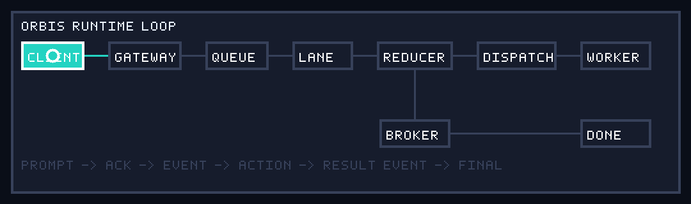
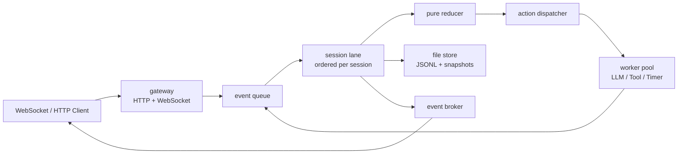
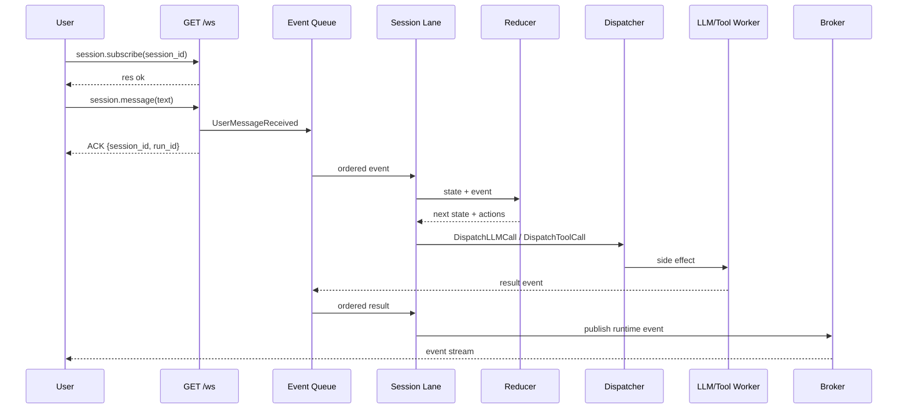

# Orbis Agent Runtime

Orbis는 장시간 실행되는 AI agent를 위한 Go 기반 runtime입니다. 핵심 목표는
LLM이 직접 loop를 제어하지 않고, runtime이 event ordering, state transition,
action dispatch, cancellation, timeout, persistence, WebSocket streaming을
소유하게 만드는 것입니다.

```text
Event + Current State => New State + Actions
```

LLM은 loop 자체가 아니라 worker 중 하나입니다.



## 현재 상태

- v0.1 runtime kernel: session lane, reducer, dispatcher, worker, broker, JSONL persistence
- v0.2 tool calling: mock tool registry, policy, idempotency, retry, timeout, result events
- v1 skills: run 시작 시 procedural knowledge를 선택해 LLM context에 주입
- v2 skill learning: run으로부터 reviewable proposal을 만들고, admin 승인 후 seed skill로 promotion
- `/debug`: 실제 WebSocket event stream을 그래픽으로 확인하는 runtime visualizer

## 아키텍처

Orbis는 v0.x에서 modular monolith로 유지합니다. 하나의 Go process 안에서 package
boundary를 분리하고, 외부 broker나 microservice는 아직 도입하지 않습니다.



패키지 책임은 다음처럼 나뉩니다.

| Package | Responsibility |
| --- | --- |
| `cmd/orbis` | CLI entrypoint: `serve`, `ws smoke [tool\|skill]` |
| `internal/app` | runtime service 조립과 WebSocket method 처리 |
| `internal/domain` | event, action, run, session 등 안정적인 domain type |
| `internal/runtime` | reducer, dispatcher, session lane, loop coordination |
| `internal/worker` | LLM, tool, timer side effect 실행 |
| `internal/gateway` | HTTP/WebSocket boundary와 `/debug` visualizer |
| `internal/broker` | session subscriber에게 runtime event broadcast |
| `internal/store` | JSONL event log와 session/run snapshot 저장 |
| `internal/skill` | skill index, selection, context injection, proposal promotion |
| `internal/tool` | tool schema, registry, policy, idempotency |

## Prompt Lifecycle

사용자가 prompt를 입력하면 WebSocket handler는 LLM을 직접 호출하지 않습니다. 요청을
검증하고 `UserMessageReceived` event로 변환한 뒤 queue에 넣고 즉시 ACK를 반환합니다.
그 이후 runtime loop가 event를 처리합니다.



일반 prompt에서 기대할 수 있는 event 흐름은 다음과 같습니다.

```text
UserMessageReceived
RunStarted
RunStatusChanged
SkillSelected / SkillLoaded / SkillApplied, if matched
LLMCallStarted
AssistantDelta, optional
LLMResponseReceived
FinalAnswerEmitted
RunCompleted
```

tool call prompt에서는 중간에 `ToolCallStarted`, `ToolCallSucceeded`,
`ToolCallFailed`, `ToolCallTimedOut`, `ToolCallRejected` 같은 event가 추가됩니다.

## Runtime Invariants

- reducer는 pure function입니다. LLM, tool, network, disk, goroutine을 직접 호출하지 않습니다.
- 모든 side effect는 worker가 실행하고, 결과는 다시 event로 들어옵니다.
- 같은 session의 state mutation은 session lane 안에서 순서대로 처리됩니다.
- side effect action은 idempotency key를 가져야 합니다.
- 중요한 runtime 변화는 log, JSONL, WebSocket event stream으로 관찰 가능해야 합니다.
- cancellation과 timeout은 `context.Context`로 전달됩니다.

## 시작하기

Go 1.22+ 환경을 권장합니다.

```bash
go test ./...
```

`.env`는 local runtime 설정입니다. 실제 값은 commit하지 않고, safe placeholder는
`.env.example`에 유지합니다.

```text
ORBIS_ADDR=:8080
ORBIS_DATA_DIR=data
ORBIS_LLM_PROVIDER=openai
ORBIS_LLM_MODEL=<model>
OPENAI_API_KEY=<api-key>
OPENAI_BASE_URL=https://api.openai.com
```

서버 실행:

```bash
go run ./cmd/orbis serve
```

상태 확인:

```bash
curl -fsS http://127.0.0.1:8080/healthz
curl -fsS http://127.0.0.1:8080/readyz
```

## Debug Visualizer

실제 runtime event loop를 눈으로 확인하려면 서버를 켠 뒤 다음 주소를 엽니다.

```bash
open http://127.0.0.1:8080/debug
```

`/debug`는 외부 client와 동일한 `/ws` protocol을 사용합니다. prompt를 보내면
runtime map에서 Gateway, Queue, Session Lane, Reducer, Dispatcher, Worker,
Broker, Terminal node가 event에 맞춰 강조되고, timeline과 payload panel에서 실제
event 내용을 확인할 수 있습니다.

추천 prompt:

```text
안녕. Orbis 런타임 이벤트 루프가 정상 동작하는지 짧게 답해줘.
```

skill selection 확인:

```text
WebSocket으로 Orbis 런타임 테스트 방법 알려줘.
```

tool call 확인:

```text
Use the math.add tool to add 1 and 2, then reply with the numeric result.
```

## WebSocket Smoke Test

서버를 실행한 상태에서 다른 terminal에서 smoke client를 실행합니다.

```bash
go run ./cmd/orbis ws smoke          # basic run to RunCompleted
go run ./cmd/orbis ws smoke tool     # real tool call path
go run ./cmd/orbis ws smoke skill    # skill selection + injection path
```

smoke client는 `session.subscribe` 후 `session.message`를 보내고, ACK와 event
이름을 출력합니다. `RunCompleted`까지 도달하지 못하면 실패합니다.

## Manual WebSocket Test

```bash
wscat -c ws://localhost:8080/ws
```

먼저 session을 subscribe합니다.

```json
{"type":"req","id":"sub_1","method":"session.subscribe","params":{"session_id":"manual_1"}}
```

그 다음 prompt를 보냅니다.

```json
{"type":"req","id":"msg_1","method":"session.message","params":{"session_id":"manual_1","text":"안녕. Orbis 런타임 테스트 중이야."}}
```

저장된 event log는 다음 위치에서 확인할 수 있습니다.

```bash
tail -n 50 data/events/manual_1.jsonl
```

## HTTP / WebSocket API

기본 HTTP endpoint:

```text
GET  /healthz
GET  /readyz
GET  /debug
GET  /ws
GET  /skills
GET  /skills/{skillID}
POST /skills/reload
GET  /skill-proposals?status=pending
GET  /skill-proposals/{proposalID}
POST /runs/{runID}/skill-proposals
POST /skill-proposals/{proposalID}/approve
POST /skill-proposals/{proposalID}/reject
```

주요 WebSocket method:

```json
{"type":"req","id":"create_1","method":"session.create","params":{"session_id":"session_1"}}
{"type":"req","id":"sub_1","method":"session.subscribe","params":{"session_id":"session_1"}}
{"type":"req","id":"msg_1","method":"session.message","params":{"session_id":"session_1","text":"안녕"}}
{"type":"req","id":"status_1","method":"run.status","params":{"run_id":"run_msg_1"}}
{"type":"req","id":"events_1","method":"events.list","params":{"session_id":"session_1","after_seq":0,"limit":100}}
{"type":"req","id":"cancel_1","method":"run.cancel","params":{"run_id":"run_msg_1"}}
```

skill catalog method는 read-only입니다. `skill.reload`는 admin token이 필요합니다.

```json
{"type":"req","id":"sk_1","method":"skill.list"}
{"type":"req","id":"sk_2","method":"skill.get","params":{"skill_id":"websocket-runtime-test"}}
{"type":"req","id":"sk_3","method":"skill.reload","params":{"token":"dev-orbis-admin"}}
```

## Skills

Orbis skill은 tool이 아닙니다. Skill은 LLM prompt에 주입되는 procedural knowledge이고,
side effect를 실행하지 않습니다.

현재 seed skill:

- `websocket-runtime-test`
- `tool-calling-policy`
- `go-reducer-pattern`
- `web-search`
- `docs-lookup`
- `github-search`
- `runtime-debug`
- `test-plan`

자세한 내용은 [docs/skills.md](docs/skills.md)를 참고합니다.

## Tool Calling

Tool call도 runtime loop를 통과합니다.

```text
LLM proposes tool call
-> reducer validates policy
-> dispatcher sends action to Tool Worker
-> Tool Worker executes with timeout/idempotency/retry
-> result returns as ToolCallSucceeded / ToolCallFailed event
-> reducer continues the run
```

자세한 내용은 [docs/tool-calling.md](docs/tool-calling.md)를 참고합니다.

## Local Verification Checklist

변경 전후 기본 검증:

```bash
go test ./...
go test -race ./...
git diff --check
```

runtime 수동 검증:

```bash
go run ./cmd/orbis serve
curl -fsS http://127.0.0.1:8080/healthz
go run ./cmd/orbis ws smoke
go run ./cmd/orbis ws smoke skill
```

UI 확인:

```bash
open http://127.0.0.1:8080/debug
```

## Non-goals

v0.x에서는 다음을 의도적으로 제외합니다.

- OpenClaw/Hermes compatibility layer
- Slack/Telegram/Discord gateway
- MCP integration
- distributed queue or external broker
- Kubernetes deployment
- long-term memory system beyond current skill proposal flow

Orbis의 우선순위는 작은 runtime kernel을 안정적으로 완성하는 것입니다.
