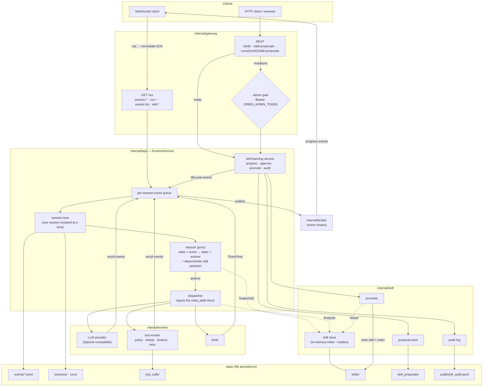
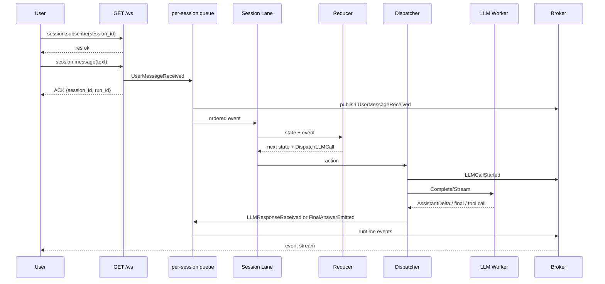

# Orbis Agent Runtime

Orbis is a Go-based, event-loop-first runtime for long-running AI agents.

The runtime owns session state, event ordering, action dispatch, cancellation,
observability, and WebSocket progress streaming. The LLM is a worker inside the
loop, not the loop controller.

> Design source of truth: [`AGENTS.md`](AGENTS.md). Feature docs:
> [`docs/tool-calling.md`](docs/tool-calling.md), [`docs/skills.md`](docs/skills.md),
> [`docs/skill-learning.md`](docs/skill-learning.md).

## Architecture

The core rule is `Event + Current State => New State + Actions`. A reducer
decides state transitions; workers execute side effects and return new events;
WebSocket clients observe progress through an event stream.

```text
WebSocket client
  └─ session.message  ──▶ validate → Event → enqueue → immediate ACK
                          │
                          ▼
              per-session event queue        (ordering)
                          │
                          ▼
                    Session Lane             (one session mutated at a time)
                          │
                          ▼
                     Reducer (pure)          → NextState + Actions + derived Events
                          │
                          ▼
                    Dispatcher               (worker boundary)
        DispatchLLMCall · DispatchToolCall · ScheduleTimer · EmitFinalAnswer
                          │
                          ▼
             Workers: LLM · Tool · Timer     → result Events
                          │
                          ▼
        Session Lane ─▶ Broker ─▶ WebSocket event stream
```

### System composition

The full system — the runtime loop, the skill subsystem, and the v2 reviewable
learning loop — in one picture (rendered by GitHub via Mermaid):



Reading the picture through the invariants: everything enters as an **event**
through the per-session queue; the **lane** serializes state mutation; the
**reducer** is pure (its only skill interaction is an in-memory snapshot read);
**workers** own every side effect and answer with new events; the **broker**
streams progress to subscribers; and the v2 **learning loop** lives entirely in
the app layer — it can only create proposals, and only an admin-gated approval
promotes one into `data/skills/` (followed by an index reload).

### Prompt lifecycle

When a user enters a prompt, the WebSocket handler only validates the request,
persists the initial run/session records, enqueues a runtime event, and returns
an ACK. The LLM call happens later through the dispatcher and worker boundary.



Important event sequence for a normal prompt:

```text
UserMessageReceived
RunStarted
RunStatusChanged
SkillSelected / SkillLoaded / SkillApplied, if a skill matches
LLMCallStarted
AssistantDelta, optional
LLMResponseReceived
FinalAnswerEmitted
RunCompleted
```

### Package layout

One deployable Go process (modular monolith). Responsibilities:

| Package | Responsibility |
| --- | --- |
| `cmd/orbis` | CLI entrypoint: `serve`, `ws smoke [tool\|skill]` |
| `internal/app` | Runtime service wiring, HTTP server construction, graceful shutdown (`RuntimeService.Close`) |
| `internal/domain` | Stable core types: `Event`, `Action`, `SessionState`, `RunState`, `SkillRef`; event/status constants |
| `internal/runtime` | Pure reducer, session lane, action dispatcher, LLM context builder |
| `internal/worker` | Side-effect execution: OpenAI-compatible LLM provider, tool worker |
| `internal/tool` | `Tool` interface, registry, toolsets, policy, retry, idempotency, mock tools |
| `internal/skill` | File-based skill store, deterministic selector, `<orbis_skills>` context builder, skill events |
| `internal/gateway` | HTTP + WebSocket boundary (routing, WS request loop, skill HTTP endpoints, debug webview) |
| `internal/broker` | WebSocket event broker (per-session publish/subscribe) |
| `internal/protocol` | Wire DTOs (request/response/event envelopes, skill payloads) |
| `internal/store` | File store: JSONL events, JSON session/run snapshots, tool-call records |
| `internal/queue` | In-memory event queue |
| `internal/config` | `.env` loading into `Config` |

### Runtime invariants

- **Reducer is pure** — no LLM/tool/IO/goroutines; only state → next state + actions + derived events.
- **Session state is serialized** — one reducer mutates a session at a time (session lane); different sessions run concurrently.
- **Workers own side effects** — LLM/tool/timer calls happen in workers and return as events.
- **Idempotency** — every side-effecting action carries a stable idempotency key.
- **Observability** — structured `slog` logs plus runtime events for every important transition.
- **Cancellation** — `context.Context`; a cancelled run dispatches no new side effects.
- **Graceful shutdown** — `RuntimeService.Close()` drains in-flight session-queue and dispatch goroutines before exit.

## Capabilities

- **v0.1 kernel** — event loop, session lanes, reducer/dispatcher, real LLM worker, mock tools, timer, WebSocket broker, JSONL persistence, run cancel/timeout, `AssistantDelta` streaming.
- **v0.2 tool calling** — the LLM only *proposes* a tool call; the runtime validates (toolsets + ordered policy), authorizes, dispatches, executes (Tool Worker), observes, and persists it, with idempotent dedup, visible retry/backoff, timeout, and deny-by-default dangerous tools. See [`docs/tool-calling.md`](docs/tool-calling.md).
- **v1 skills** — reusable procedural knowledge, selected deterministically (no LLM) and injected as an `<orbis_skills>` instructions block before planning; lifecycle events, per-run snapshot, and a read-only skill API (WS + HTTP). See [`docs/skills.md`](docs/skills.md).
- **v1.5** — graceful server shutdown; agentic continuation after a tool-policy denial (bounded per run); tool-aware skill scoring (enabled tools boost related skills).
- **v2 skill learning** — a reviewable learning loop: the runtime derives **Skill Proposals** from completed runs (deterministic, no LLM), a human approves or rejects them over admin-guarded APIs, and only approval promotes a proposal into `data/skills/` (with provenance, versioning, an audit trail, and an automatic index reload). Nothing is promoted automatically. See [`docs/skill-learning.md`](docs/skill-learning.md).

### Tools vs Skills vs Proposals

- **Tool** = runtime-controlled side-effect execution. The LLM proposes; only the Tool Worker runs it.
- **Skill** = reusable procedural knowledge for planning and tool use. It never executes a side effect; it is loaded into the LLM context before planning.
- **Skill Proposal** = a reviewable candidate skill derived from a run. It is *not* an active skill until a human approves it (`SkillProposalCreated != SkillPromoted`).

## Quick Start

Configure runtime settings through `.env`:

```bash
cp .env.example .env
```

Required local settings:

```text
ORBIS_ADDR=:8080
ORBIS_DATA_DIR=data
ORBIS_LLM_PROVIDER=openai
ORBIS_LLM_MODEL=<model>
ORBIS_RUN_TIMEOUT=2m
OPENAI_API_KEY=<api-key>
OPENAI_BASE_URL=https://api.openai.com
```

Start the server (SIGINT/SIGTERM shuts down gracefully and drains the runtime):

```bash
go run ./cmd/orbis serve
```

Open the built-in runtime debugger:

```text
http://localhost:8080/debug
```

The debug view uses the same WebSocket protocol as external clients. Enter a
prompt, watch the ACK, runtime event timeline, run status, selected event
payloads, and final answer in one browser view.

Run a WebSocket smoke client against the configured `ORBIS_ADDR`:

```bash
go run ./cmd/orbis ws smoke          # basic run to RunCompleted
go run ./cmd/orbis ws smoke tool     # drives a real tool call
go run ./cmd/orbis ws smoke skill    # drives skill selection + injection
```

The smoke client sends a `session.message` request, prints ACK/event names, and
exits successfully only after `RunCompleted`.

## WebSocket & HTTP API

Connect to `ws://localhost:8080/ws` and send request envelopes:

```json
{"type":"req","id":"create_1","method":"session.create","params":{"session_id":"session_1"}}
```

```json
{"type":"req","id":"msg_1","method":"session.message","params":{"session_id":"session_1","text":"안녕"}}
```

```json
{"type":"req","id":"sub_1","method":"session.subscribe","params":{"session_id":"session_1"}}
```

```json
{"type":"req","id":"status_1","method":"run.status","params":{"run_id":"run_msg_1"}}
```

```json
{"type":"req","id":"events_1","method":"events.list","params":{"session_id":"session_1","after_seq":0,"limit":100}}
```

```json
{"type":"req","id":"cancel_1","method":"run.cancel","params":{"run_id":"run_msg_1"}}
```

Skill inspection methods (read-only; never execute a skill). `skill.reload` is
mutating and requires the admin token as of v2:

```json
{"type":"req","id":"sk_1","method":"skill.list"}
{"type":"req","id":"sk_2","method":"skill.get","params":{"skill_id":"websocket-runtime-test"}}
{"type":"req","id":"sk_3","method":"skill.reload","params":{"token":"dev-orbis-admin"}}
```

Skill-learning methods (v2). Mutating methods carry the admin token in params:

```json
{"type":"req","id":"sp_1","method":"skill.proposal.list","params":{"status":"pending"}}
{"type":"req","id":"sp_2","method":"skill.proposal.get","params":{"proposal_id":"prop_run_1"}}
{"type":"req","id":"sp_3","method":"skill.proposal.create_from_run","params":{"run_id":"run_1","token":"dev-orbis-admin"}}
{"type":"req","id":"sp_4","method":"skill.proposal.approve","params":{"proposal_id":"prop_run_1","token":"dev-orbis-admin"}}
{"type":"req","id":"sp_5","method":"skill.proposal.reject","params":{"proposal_id":"prop_run_1","reason":"too narrow","token":"dev-orbis-admin"}}
```

HTTP endpoints (admin-gated routes take `Authorization: Bearer <ORBIS_ADMIN_TOKEN>`;
with no token configured they are disabled entirely):

```text
GET  /healthz
GET  /readyz
GET  /debug                                # browser runtime debugger
GET  /ws                                    # upgrades to WebSocket
GET  /skills                                # skill catalog (when skills enabled)
GET  /skills/{skillID}                      # one skill (metadata + body), 404 if unknown
POST /skills/reload                         # reload the skill index (admin)
GET  /skill-proposals?status=pending        # review queue (when learning enabled)
GET  /skill-proposals/{proposalID}          # one proposal incl. body, 404 if unknown
POST /runs/{runID}/skill-proposals          # create a proposal from a run (admin)
POST /skill-proposals/{proposalID}/approve  # approve + promote + reload (admin)
POST /skill-proposals/{proposalID}/reject   # reject, body {"reason":"..."} (admin)
```

## Configuration

All settings load from `.env` (see [`.env.example`](.env.example)); nothing is
hard-coded. Groups:

- **Core** — `ORBIS_ADDR`, `ORBIS_DATA_DIR`, `ORBIS_LLM_PROVIDER`, `ORBIS_LLM_MODEL`, `ORBIS_RUN_TIMEOUT`, `OPENAI_API_KEY`, `OPENAI_BASE_URL`.
- **Tools** — `ORBIS_TOOLSETS` (default `safe`), `ORBIS_TOOL_TIMEOUT_*`, `ORBIS_TOOL_RETRY_*`, `ORBIS_TOOL_DENIAL_CONTINUATION_MAX` (default 2; 0 fails the run on denial).
- **Skills** — `ORBIS_SKILLS_ENABLED` (default true), `ORBIS_SKILLS_DIR`, `ORBIS_SKILLS_MAX_SELECTED`, `ORBIS_SKILLS_MAX_CHARS`, `ORBIS_SKILLS_RELOAD_ON_START`.
- **Skill learning** — `ORBIS_SKILL_LEARNING_ENABLED` (default true), `ORBIS_SKILL_PROPOSALS_DIR`, `ORBIS_SKILL_AUDIT_PATH`, `ORBIS_ADMIN_TOKEN` (default empty = mutating endpoints disabled), `ORBIS_SKILL_AUTO_PROPOSE` (default false; creates pending proposals only, never promotes).
- **WebSocket** — `ORBIS_WS_READ_TIMEOUT` (default 0 = disabled).

| Area | Main settings | Effect |
| --- | --- | --- |
| Server | `ORBIS_ADDR`, `ORBIS_DATA_DIR` | HTTP/WebSocket bind address and file persistence root |
| LLM | `ORBIS_LLM_PROVIDER`, `ORBIS_LLM_MODEL`, `OPENAI_API_KEY`, `OPENAI_BASE_URL` | Real OpenAI-compatible provider used by the LLM Worker |
| Run lifecycle | `ORBIS_RUN_TIMEOUT`, `ORBIS_WS_READ_TIMEOUT` | Run timeout and idle WebSocket read behavior |
| Tools | `ORBIS_TOOLSETS`, `ORBIS_TOOL_TIMEOUT_*`, `ORBIS_TOOL_RETRY_*` | Enabled toolsets, per-call timeout bounds, and retry/backoff policy |
| Skills | `ORBIS_SKILLS_*` | Deterministic skill selection and `<orbis_skills>` context injection |
| Learning | `ORBIS_SKILL_*`, `ORBIS_ADMIN_TOKEN` | Reviewable skill proposals, approval/promotion, and audit trail |

## Persistence

File-based under `ORBIS_DATA_DIR` (`data/` by default):

```text
data/events/{session_id}.jsonl   # append-only event log (replayable)
data/sessions/{session_id}.json  # latest session snapshot
data/runs/{run_id}.json          # latest run snapshot (incl. selected skills)
data/tool_calls/{key}.json       # tool-call idempotency records
data/skills/                     # committed seed skills + promoted learned skills
data/skill_proposals/            # review queue: pending/ approved/ rejected/
data/audit/skill_audit.jsonl     # skill-learning audit trail
```

## Development

```bash
make test
make run
make smoke
```

### Runtime testing checklist

Use this sequence when validating runtime behavior locally:

```bash
go test ./...
go test -race ./...
git diff --check
go run ./cmd/orbis serve
```

Then, in another terminal:

```bash
curl -fsS http://127.0.0.1:8080/healthz
go run ./cmd/orbis ws smoke
go run ./cmd/orbis ws smoke tool
go run ./cmd/orbis ws smoke skill
```

For visual inspection, open `http://127.0.0.1:8080/debug`, send a prompt, and
verify that the timeline reaches `RunCompleted`. If it reaches `RunFailed`,
select the failure event and inspect its payload.

For manual WebSocket inspection with `wscat`:

```bash
wscat -c ws://localhost:8080/ws
```

Send a subscription first:

```json
{"type":"req","id":"sub_1","method":"session.subscribe","params":{"session_id":"manual_1"}}
```

Then send a prompt:

```json
{"type":"req","id":"msg_1","method":"session.message","params":{"session_id":"manual_1","text":"안녕. Orbis 런타임 테스트 중이야."}}
```
